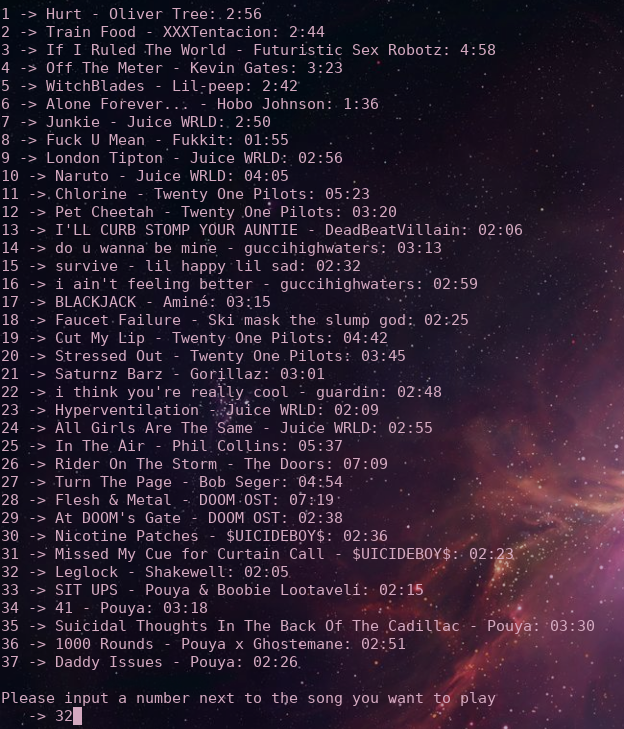
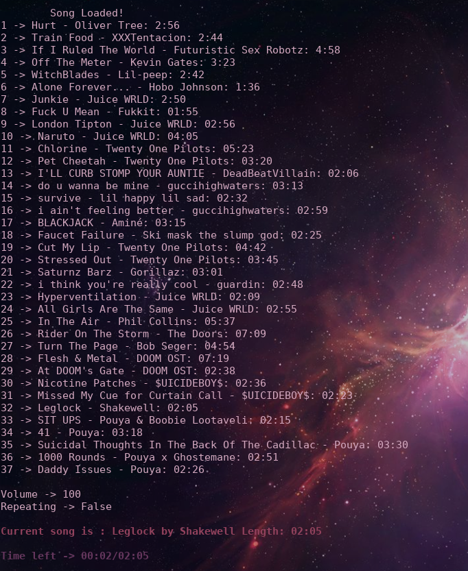

## MPL
[YOU NEED TO HAVE VLC INSTALLED](https://www.videolan.org/index.html)
* add songs to [songs/](songs/)
* python3 util.py
* press 1 to add the songs
* press 2 and mass download urls
* python3 go.py

**THIS DOES NOT WORK ON WINDOWS**

## In use

